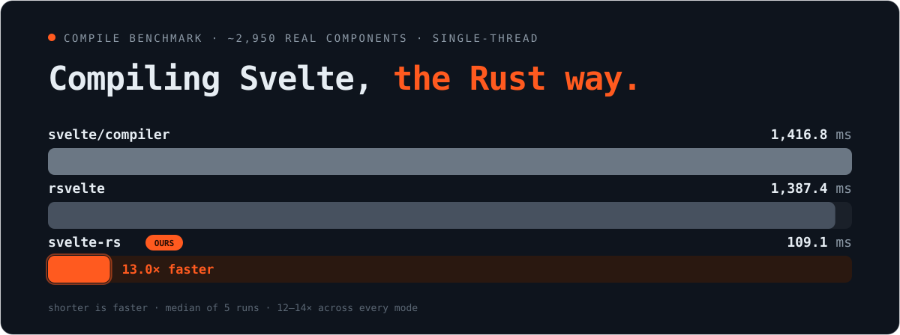

<div align="center">

# svelte-rs

**The Svelte 5 compiler, rewritten in Rust.**

Drop-in replacement for `svelte/compiler` (pinned to **svelte@5.56.4**) — same JS output, ~13× faster.

[](https://codspeed.io/MrWaip/svelte-rs-2)
[](https://www.npmjs.com/package/@mrwaip/svelte-rs2)
[](https://www.npmjs.com/package/@mrwaip/vite-plugin-svelte)
[](./tasks/compiler_tests/cases2)

[Playground](https://mrwaip.github.io/svelte-rs-2/) · [Roadmap](./ROADMAP.md)

> ⚠️ **WIP / canary.** Built by a human with heavy AI assistance. Expect bugs, missing edge cases, and breaking changes. Not production-ready — please report what breaks.

</div>

---

## Why



- **Byte-exact JS output** — **~1,200 cases** expand to **10,000+ passing e2e tests**, each diffed against the reference compiler across client + server × dev + prod.
- **Drop-in** — same `compile()` / `compileModule()` API as `svelte/compiler`.
- **~13× faster** across the full 2,825-file corpus (client 12.7×, server 13.6×, dev variants ~12×).
- **Ready to try** — wired into a fork of `vite-plugin-svelte`, so it runs in a real Vite app today.

### Requirements

| | |
| --- | --- |
| Node | `^20.19 \|\| ^22.12 \|\| >=24` |
| Platforms | macOS arm64/x64, Linux x64 glibc. Windows and Linux musl (Alpine) not yet. |
| Peer | `svelte@5.56.4` — Vite plugin falls back to `svelte/compiler` for unsupported options. |

## Status

Parity target: **svelte@5.56.4**. Check this before logging an issue.

| Feature | Status | Notes |
| --- | --- | --- |
| Svelte 5 syntax | done | Runes, template, bindings, directives, events, special elements, diagnostics, a11y. |
| Svelte 4 legacy | done | `export let`, `$:`, `beforeUpdate`/`afterUpdate`, `<slot>`, `<svelte:self>`, `<svelte:component>`, auto-mode detection. |
| CSS pipeline | done | analyze + transform + codegen. |
| TypeScript | done | Script stripping only — no type checking. |
| `.svelte.js` / `.svelte.ts` modules | done | — |
| Dev mode (`dev: true`) | done | Byte-exact client-dev and server-dev; some ownership/hydration diagnostics land case-by-case. |
| SSR (`generate: 'server'`) | done | Server transform + codegen (prod & dev). |
| Source maps | done | `js.map` / `css.map` emitted; `sourcemap` option honored. |
| HMR | done | Hot-module-replacement output supported. |
| Custom elements | in progress | Basic path works; some option combinations not covered. |
| Compiler options | in progress | Most common options honored (incl. `discloseVersion`, `warningFilter`); long tail still landing. |
| Preprocessors | not ready | Not started. |

**done** — no known deficits; OK to log bugs. **in progress** — partially working; log panics only. **not ready** — don't file bugs yet. Full breakdown: [ROADMAP.md](./ROADMAP.md).

### Known limitations

- `ast` option throws; the returned `ast` is always `null`.
- `outputFilename` option throws.
- `modernAst: true` is accepted but ignored (emits `unsupported_option_ignored` warning).
- `dev: true` runtime checks land case-by-case — not all ownership / hydration diagnostics are emitted yet.

## Install

### As a compiler

```sh
npm i -D @mrwaip/svelte-rs2
```

```js
import { compile } from '@mrwaip/svelte-rs2/compiler';

const { js } = compile(
  `<script>let { name } = $props();</script><h1>hello {name}</h1>`,
  { filename: 'Hello.svelte', generate: 'client' }
);

console.log(js.code);
```

The API mirrors `svelte/compiler`; see `packages/svelte-rs2/compiler/index.d.ts`. A few opt-in extras beyond the reference API:

- **`warningFilter: (warning) => boolean`** — matches Svelte 5's option; drops warnings the predicate rejects.
- **`suppress: WarningCode[]`** — a typed list of warning codes dropped at the source. Cheaper than filtering after the fact: suppressed warnings are never built, framed, or serialized.
- **`withDiagnostics: true`** — returns `{ js, css, diagnostics }` where each diagnostic carries `severity: 'error' | 'warning'`, and never throws on error. Handy for editors, linters, and batch tooling.

Real input → output for every mode lives in [`tasks/compiler_tests/cases2/`](./tasks/compiler_tests/cases2): `case.svelte` plus our output and the reference (`case-rust.js` / `case-svelte.js`, `.dev.js`, `.server.js`, `.server.dev.js`).

### In a Vite app

The fork of `vite-plugin-svelte` routes `compile` / `compileModule` through `@mrwaip/svelte-rs2` automatically, falling back to `svelte/compiler` for options the Rust side doesn't support yet.

```sh
npm i -D @mrwaip/vite-plugin-svelte
```

```js
import { defineConfig } from 'vite';
import { svelte } from '@mrwaip/vite-plugin-svelte';

export default defineConfig({
  plugins: [svelte()],
});
```

Source: <https://github.com/MrWaip/vite-plugin-svelte>.

## Benchmarks

Whole-corpus throughput: **2,825 real `.svelte`/`.svelte.js` files**, each compiled in every mode, single-threaded, one file at a time. Median of 5 runs, measured 2026-07-18 via `just bench-compare` on a 12-core Linux x64.

| mode | svelte | rsvelte | ours | vs svelte | vs rsvelte |
| --- | ---: | ---: | ---: | ---: | ---: |
| client | 1403.8 ms | 676.6 ms | 110.9 ms | **12.7×** | **6.1×** |
| client-dev | 1490.9 ms | 913.1 ms | 127.1 ms | **11.7×** | **7.2×** |
| ssr | 1222.6 ms | 533.0 ms | 89.9 ms | **13.6×** | **5.9×** |
| ssr-dev | 1321.6 ms | 667.2 ms | 101.7 ms | **13.0×** | **6.6×** |

Reproduce with `just bench-compare`. Per-run instruction-count benchmarks (64 total) also run on every commit via [CodSpeed](https://codspeed.io/MrWaip/svelte-rs-2). The [rsvelte](#alternatives) column appears when its native binding is installed. Speedup climbs further on large single components, where fixed per-file overhead amortizes.

## Alternatives

- [**rsvelte**](https://github.com/baseballyama/rsvelte) — another Rust port of the Svelte 5 compiler, also built on OXC. Ships a WASM build (`@rsvelte/compiler`), a native NAPI binding, and a multi-threaded `compileBatch` API.

## Try it locally

Requires Rust, Node, and [`just`](https://github.com/casey/just) (`cargo install just` or `brew install just`).

```sh
just playground               # build wasm + serve playground
just quick-check App.svelte   # diff one component against svelte/compiler
just test-compiler            # run the 10,000+ test e2e suite (all modes)
```

## Contributing

Standard PRs welcome — no AI required. Day-to-day work uses [Claude Code](https://claude.com/claude-code); slash commands live in `.claude/commands/` (`/status`, `/port`, `/audit`). Before opening a PR: `just test-compiler && just test-diagnostics && just lint` must be green.

Bugs and questions: <https://github.com/MrWaip/svelte-rs-2/issues>.

## Acknowledgements

- [Svelte](https://github.com/sveltejs/svelte) — the compiler this project mirrors; reference output is the source of truth.
- [OXC](https://github.com/oxc-project/oxc) — JS parser, AST, and codegen.
- [vite-plugin-svelte](https://github.com/sveltejs/vite-plugin-svelte) — base of the Vite integration fork.

## License

[MIT](./LICENSE) © Lobkov Constantine
